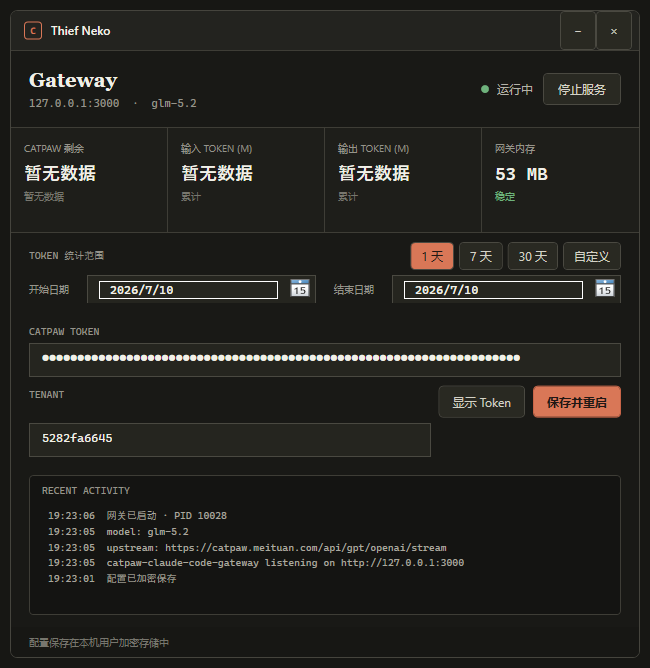

# Thief Neko

Thief Neko 是一个 Windows 本地网关和桌面控制器，将 Catpaw 中可用的 GLM 模型接入 Claude Code Desktop。



```text
Claude Code Desktop -> http://127.0.0.1:3000/v1/messages
                    -> Catpaw Agent API
                    -> Claude 工具调用与流式回复
```

## 功能

- Anthropic 兼容的 `/v1/messages` 流式接口
- Claude Code Desktop 原生 `Read`、`Write`、`Edit`、`Glob`、`Grep` 工具循环
- Windows 主机路径与 Claude Desktop VM 路径转换
- Catpaw Agent 会话隔离、重复文本折叠和工具参数适配
- Windows 桌面控制器、托盘、启动/停止和加密 Token 保存
- 自动读取并热更新 Catpaw Token，认证轮换时透明重试一次
- Catpaw 剩余次数、输入/输出 Token、内存和活动状态
- 按自然日保存 Token 历史，支持 1 天、7 天、30 天和自定义日期范围
- 请求体、流缓冲、会话数量和上游超时限制

## 环境要求

- Windows 10/11 x64
- [Node.js 24 或更高版本](https://nodejs.org/)
- 已安装并登录 Catpaw 桌面客户端
- Claude Code Desktop
- CCSwitch（推荐，但不是网关运行的必需组件）

Release 中的 `ThiefNeko.exe` 已包含 .NET 运行时，不需要另外安装 .NET。

## 安装和启动

1. 从 GitHub Releases 下载 `Thief-Neko-v0.1.3-win-x64.zip`。
2. 完整解压，不能只把 EXE 单独拿出来；程序需要同目录中的 `src`。
3. 确认 Catpaw 已登录。
4. 双击 `ThiefNeko.exe`。
5. 填入 Catpaw Token 和 Tenant，点击“保存并重启”。

默认 Tenant：

```text
5282fa6645
```

Token 使用 Windows DPAPI 加密保存到：

```text
%LOCALAPPDATA%\Catapi\settings.json
```

Token 使用统计保存到：

```text
%LOCALAPPDATA%\Catapi\usage.json
```

## 获取 Catpaw Token

### 方法一：从 Catpaw 本机登录态复制（推荐）

在 Thief Neko 解压目录打开 PowerShell：

```powershell
$state = node .\src\catpawState.js | ConvertFrom-Json
$state.token | Set-Clipboard
```

执行后 Token 已进入剪贴板，直接粘贴到 Thief Neko 的 `CATPAW TOKEN` 输入框。

勾选 Token 输入框下方的“自动获取 Catpaw Token”后，Thief Neko 会在启动网关前读取 Catpaw 当前登录状态，并在运行期间每 5 秒检查一次。Token 发生轮换时会直接热更新内存中的请求凭证；如果某个请求先收到 401，网关会读取最新 Token 并透明重试一次。读取失败时会保留上一个可用 Token。该功能不会主动发送模型请求或消耗 Catpaw 推理次数。

如果输出为空或报登录状态不存在：

1. 启动 Catpaw。
2. 重新登录 Catpaw。
3. 再执行上面的命令。

### 方法二：从开发者工具获取

这个方法只打开 Catpaw 设置页，不需要发送模型对话，不消耗推理次数。

1. 打开 Catpaw 设置页，滚动到显示剩余额度的位置。
2. 按 `Ctrl+Shift+I` 打开开发者工具；也可以使用“帮助 -> 切换开发人员工具”。
3. 选择 `Network`。
4. 刷新设置页或重新进入设置页。
5. 筛选请求：`/api/user/limit`。
6. 打开请求，在 `Request Headers` 中找到 `Catpaw-Auth`。
7. 只复制原始值，不要复制字段名，不要添加 `Bearer `。

不要把 Token 发到聊天、Issue、日志或 Git 仓库。Token 失效时重新登录 Catpaw 并获取新值。

## CCSwitch 配置

先启动 Thief Neko，确认窗口显示“运行中”，再切换 CCSwitch Provider。

### Claude Code Desktop

在 CCSwitch 中新增 `Claude Desktop` Provider，名称可以填写 `Thief Neko GLM-5.2`。配置内容：

```json
{
  "env": {
    "ANTHROPIC_BASE_URL": "http://127.0.0.1:3000",
    "ANTHROPIC_API_KEY": "local-gateway"
  }
}
```

将这个 Provider 设为当前 Provider，然后完全退出并重启 Claude Code Desktop。

### Claude Code CLI

如果同时使用 Claude Code CLI，可以新增 `Claude` Provider：

```json
{
  "env": {
    "ANTHROPIC_BASE_URL": "http://127.0.0.1:3000",
    "ANTHROPIC_AUTH_TOKEN": "local-gateway",
    "ANTHROPIC_API_KEY": "local-gateway",
    "ANTHROPIC_MODEL": "glm5.2",
    "ANTHROPIC_SMALL_FAST_MODEL": "glm5.2"
  }
}
```

`local-gateway` 只是本机占位值，不是 Catpaw Token。真实 Catpaw Token 只保存在 Thief Neko 控制器中。

## 不使用 CCSwitch

PowerShell 中可以直接设置：

```powershell
$env:ANTHROPIC_BASE_URL = "http://127.0.0.1:3000"
$env:ANTHROPIC_API_KEY = "local-gateway"
```

## 健康检查

```powershell
Invoke-RestMethod http://127.0.0.1:3000/health
Invoke-RestMethod http://127.0.0.1:3000/v1/models
Invoke-RestMethod http://127.0.0.1:3000/admin/status
```

## 从源码运行

```powershell
npm test
powershell -ExecutionPolicy Bypass -File .\start-gateway.ps1 -NonInteractive
```

构建桌面控制器和 Release 压缩包：

```powershell
powershell -ExecutionPolicy Bypass -File .\controller\release.ps1
```

## 常见问题

### Claude Code 一直停在 Preparing session

- 确认 Thief Neko 显示“运行中”。
- 确认 CCSwitch 的 Base URL 是 `http://127.0.0.1:3000`，不要添加 `/v1`。
- 切换 Provider 后完全退出并重启 Claude Code Desktop。

### API key rejected 或突然退出登录

启用“自动获取 Catpaw Token”后，正常的 Token 轮换会由网关热更新，不需要重启，也不会把瞬时 401 返回给 Claude。若 Catpaw 已退出登录或新 Token 尚未生成，网关会返回临时 503，避免 Claude 将本地 Provider 判定为 API Key 失效；重新登录 Catpaw 后重试当前操作即可。

如果问题只在 Clash 全局代理开启后出现，建议改用规则模式并让以下域名直连：

```yaml
- DOMAIN,catpaw.meituan.com,DIRECT
- DOMAIN,catpaw-api.meituan.net,DIRECT
```

### Token 统计显示暂无数据

统计只使用 Catpaw 返回的真实 usage，不按文本长度估算。首次完成一个包含 usage 的请求后开始累计；旧版日志无法准确补算。

## 安全与说明

- 网关只监听 `127.0.0.1`。
- 管理状态接口不返回 Token、Cookie、提示词或工具参数。
- 仅使用你自己的 Catpaw 账号和额度，并遵守相关服务条款。
- 本项目与 Catpaw、美团、Anthropic 或 CCSwitch 无隶属或官方关联。
- Catpaw 的内部接口可能随客户端更新发生变化。

## License

[MIT](LICENSE)
